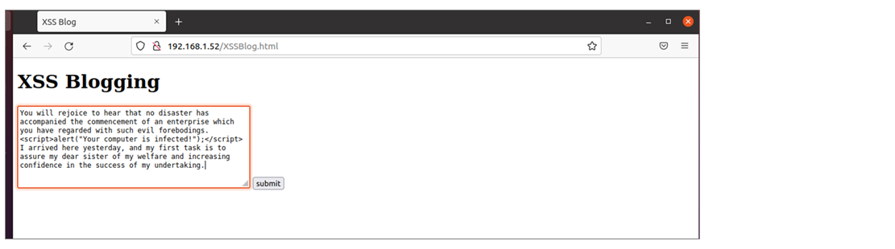
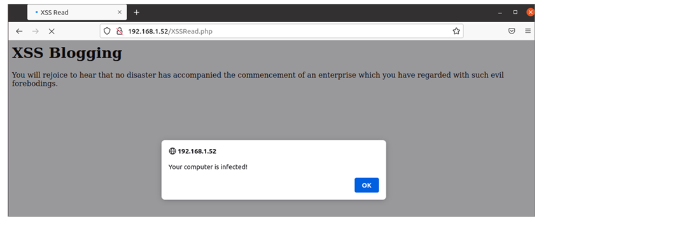

# Report Writing for Penetration Testers

We will cover the following Learning Units in this Learning Module:

- Understanding Note-Taking
- Writing Effective Technical Penetration Testing Reports

This Module is designed to help Penetration Testers understand how to deliver effective reports to their clients.

# Understanding Note-Taking

In this Learning Unit we will cover the following learning Objectives:

- Review the deliverables for penetration testing engagements
- Understand the importance of note portability
- Identify the general structure of pentesting documentation
- Choose the right note-taking tool
- Understand the importance of taking screenshots
- Use tools to take screenshots

## Penetration Testing Deliverables

A penetration test or red team exercise1 is difficult to script in advance. This is because the tester cannot consistently anticipate exactly what kind of machines or networks the client will want to be tested.

> Even though the outcome of our assessment is ofter unpredictable, is is often recommended to define a detailed scope during the preliminary meetings with the customer. This process is especially very helpful when prioritizing business critical targets within large networks.

While the general execution plan for a penetration test will often follow a particular model, most pentests tend to follow the maxim "no plan survives first contact with the enemy"2. This means that any specific activities we might expect to perform during the engagement might not actually happen, since the reality of the testing environment is almost certainly different than our initial ideas and hypotheses about it. It's therefore difficult to report on penetration tests using prepopulated forms. This is especially the case when the testing is carried out with little prior discussion with the client, for example, if the client is looking to surprise their defending teams in some manner.

As such, instead of preparing a report in advance, the penetration test is executed and notes are taken as it proceeds to ensure that there is a detailed record of what was done. This makes sure that:

- the penetration test can be repeated if it becomes necessary to demonstrate that an issue is real.
- the penetration test can be repeated after remediation to confirm that an issue has been fixed.
- if there's a system failure during the period of the penetration test, the client and tester can determine if the testing was the cause of the failure.

During a penetration test, some activities may not be permitted. We have to be very clear about the Rules of Engagement (RoE)3 under which the testing is done. When conducting red team testing, a person will often be assigned the role of "referee" to ensure that the rules of engagement are observed. There may be constraints placed on testing such as not carrying out denial of service attacks, or not engaging in social engineering. Furthermore, the testing work may be in response to the client's regulatory compliance requirements and may need to follow a specific methodology such as the OWASP Penetration Testing Execution Standard.4 Any such constraints need to be very clear from the outset.

1(Aon, 2022), https://www.aon.com/cyber-solutions/thinking/penetration-testing-or-red-teaming/ 
2(Helmuth von Moltke, 1871), https://quoteinvestigator.com/2021/05/04/no-plan 
3(Microsoft, 2022), https://www.microsoft.com/en-us/msrc/pentest-rules-of-engagement 
4(OWASP, 2022), https://owasp.org/www-project-web-security-testing-guide/latest/3-The_OWASP_Testing_Framework/1-Penetration_Testing_Methodologies 

## Note Portability 

Portability of penetration testing notes means being able to pass those notes on to others. Writing notes that are consise and coherent is an integral part of succesful note-taking, and enables the notes to be used not only by ourselves but also by others. Additionally, consise notes can be quickly adapted for technical reporting.

The need for portability is particularly emphasized when a penetration tester has to leave an engagement because of sickness, illness, or other issues. Having a shared understanding of how notes should be taken is especially important for large penetration testing teams, where individuals need to be able to understand teh details of other team members' engagement at will.

## The General Structure of Penetration Testing Notes
We need to take a structured approach to note-taking that is both concise and precise. There are an uncountable number of ways in which we might organize our notes, and it would be futile to attempt to provide a one-size-fits all set of recommendations. Nevertheless, here are some principles that often useful to consider:

- Rather than taking a few general notes assuming that we'll remember how to perform certain actions next time, we should record exactly what we did.
- This means that every command that we type, every line of code that we modify, and even anywhere we click in the GUI should be recorded so that we can reproduce our actions.
- Even if we've taken a lot of notes, if looking at them later doesn't help us remember exactly what happened during the assessment, then they won't be particularly useful to us.
- The notes need to be structured and sufficiently detailed to remove any ambiguity.
- To write a convincing and substantiated technical report later, we need to provide sufficient technical details within our notes.
- If the notes are not written coherently, it will be difficult for someone else to repeat the test and get the same results.

The structure we recommend here for note-taking is sufficiently abstract to allow for personal preferences. As a general rule, we would like the notes to remind us of what occurred, and allow us to replicate the issues we identify. A note-taking structure that starts broad and drills down into each section is an easy and expandable method of taking notes. The top-down approach guides us to start with the broadest activity, and then narrow down our focus and expand the level of detail until we have everything we need to replicate exactly what happened.

Let's now look at an example of the notes we might take for a web vulnerability we discovered:

- **Application Name**: This is important in a multi-application test, and a good habit to get into. The application names also lends itself to building a natural folder and file structure quite nicely.

- **URL**: This is the exact URL that would be used to locate the vulnerability that we've detected.

- **Request Type**: This represents both the type of request (i.e: GET, POST, OPTIONS, etc) that was made, as well as any manual changes we made to it. For example, we might intercept a POST request message and change the username or password before forwarding it on.

- **Issue Detail**: This is the overview of the vulnerability that will be triggered by our actions. For example, we may point to a CVE describing the vulnerability if one exists, and/or explain the impact we observe. We may categorize the impact as denial of service, remote code execution, privilege escalation, and so on.

- **Proof of Concept Payload**: This is a string or code block that will trigger the vulnerability. This is the most important part of the note, as it is what will drive the issue home and allow it to be replicated. It should list all of the necessary preconditions, and provide the exact code or commands that would need to be used to perform the triggers the vulnerability again.

Let’s get more specific and review an example of testing for a Cross-Site Scripting (XSS) vulnerability. The target we tested has a web page aptly named **XSSBlog.html**. When we navigate to it, we can enter a blog entry.

Figure 1: XSS Testing

When we read back the blog entry, we get the following alert:

Figure 2: XSS Testing Issue

In the course of making these requests, we keep a record of our actions, as shown below.

    Testing for Cross-Site Scripting 

    Testing Target: 192.168.1.52 
    Application:    XSSBlog
    Date Started:   31 March 2022

    1.  Navigated to the application
    http://192.168.1.52/XSSBlog.html
    Result: Blog page displayed as expected
    
    2.  Entered our standard XSS test data: 
    You will rejoice to hear that no disaster has accompanied the
    commencement of an enterprise which you have regarded with such
    evil forebodings. 
    I arrived here yesterday, and my first task is to assure my dear
    sister of my welfare and increasing confidence in the success of
    my undertaking. 

    3.  Clicked Submit to post the blog entry.
    Result: Blog entry appeared to save correctly.

    4.  Navigated to read the blog post
    http://192.168.1.52/XSSRead.php
    Result: The blog started to display and then the expected alert popped up.

    5.  Test indicated the site is vulnerable to XSS.

    PoC payload: 

  Listing 1 - Example of a Testing Note.

We now have a simple, fast, and expandable way to take coherent and comprehensive notes that another tester can follow. It's worth repeating that the notes are not themselves the report we will deliver to the client, but they will be invaluable when we attempt to put our report together later.

## Choosing the Right Note-Taking Tool

## Taking Screenshots

## Tools to Take Screenshots

